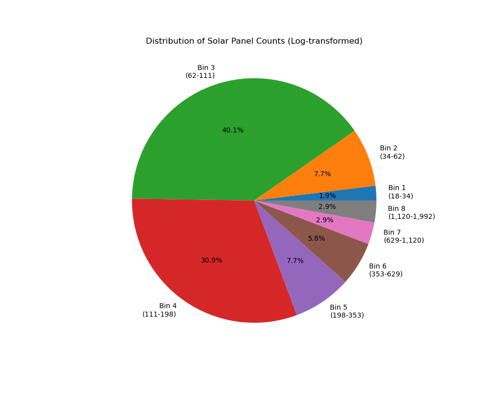
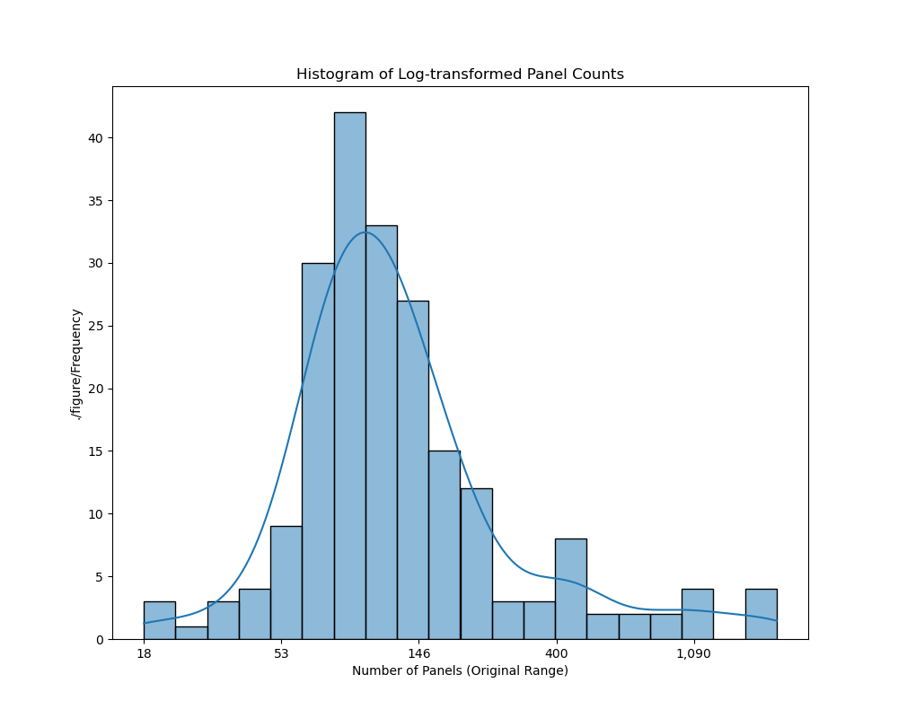
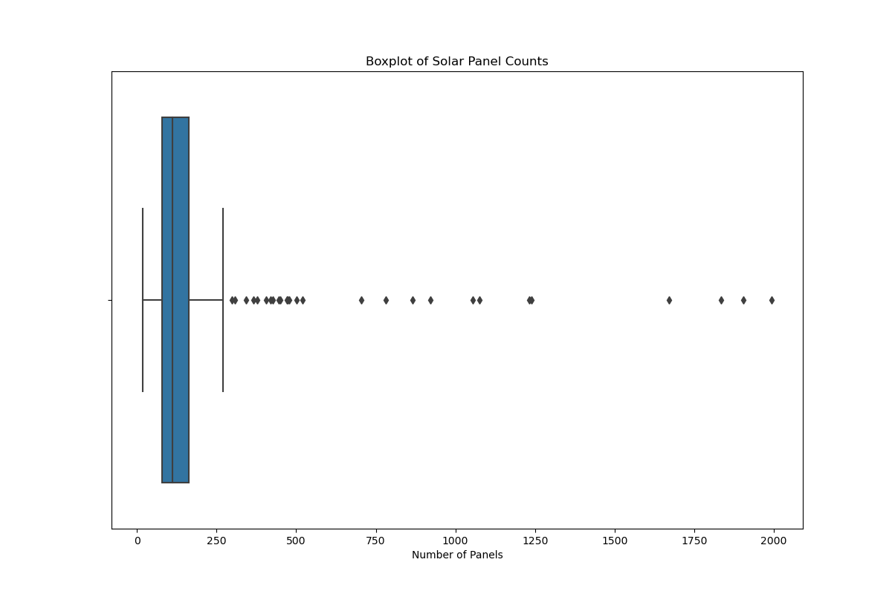
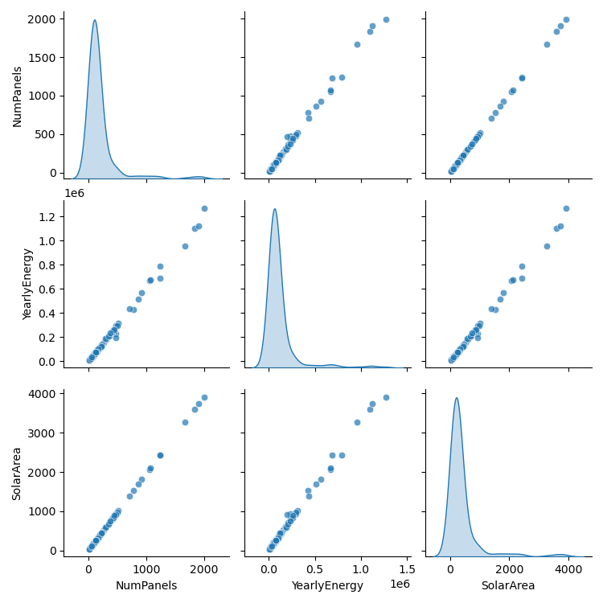

## Nov 25th, 2024
*   If a request uses `HIGH` and gets a 404 not found error message, the script then tries image quality of `MEDIUM` instead.
*   Merge the `address`, `latitude`, `longtiude`, and `max responses` together into a csv file
*   Create a `config.py` and write you own api key into it. You are free to rename the file as what you like.
*   Change the files' addresses in the `config.py` to what you want to read or write.

## Dec 1st, 2024
* Ouput four files and directory: `output.json`, `deliverable1.csv`, `deliveravle2.csv` and `original_response/` 
* Filter the data before storing them into csv
    * Drop all rows with none solar panel
    * Flag up those rows where the differences between `Lat` and `center_latitude` or `Lag` and `center_longitude` excedes threshold (temporarily, **0.0005**) in deliverable1.csv
    * Flap up those rows where solar panels are smaller than the minimum threshold or larger than the maximum threshold (temporarily, minimum threshold: **10** and maximum threshold: **2000**)
* The filter results are:
    * **Drop 4 no solar panel rows from original 266 rows, i.e. 262 raws in deliveravle1.csv and deliverable2.csv**
    * **33 rows in deliverable1.csv has abnormal latitude and longitude**
    * **32 rows in deliveravle2.csv has abnoraml solar panels**

### Demo.py show some result graphs.
  * Pie Chart of Solar Panels
  
  * Histogram of Log Panel Counts
  
  * Boxplot of Solar Panel Metrics
  
  * Scatter Plot Matrix of Solar Panel Metrics
  

### Descriptive Statistics

| Statistic | NumPanels   | YearlyEnergy       | SolarArea     |
|-----------|-------------|--------------------|---------------|
| Count     | 230.000000  | 2.300000e+02      | 230.000000    |
| Mean      | 212.213043  | 1.251063e+05      | 416.691951    |
| Std       | 303.344966  | 1.836664e+05      | 595.634477    |
| Min       | 19.000000   | 8.589278e+03      | 37.307540     |
| 25%       | 81.250000   | 4.688055e+04      | 159.538830    |
| 50%       | 114.000000  | 6.727839e+04      | 223.845260    |
| 75%       | 180.750000  | 1.037875e+05      | 354.912550    |
| Max       | 1992.000000 | 1.268119e+06      | 3911.401400   |

